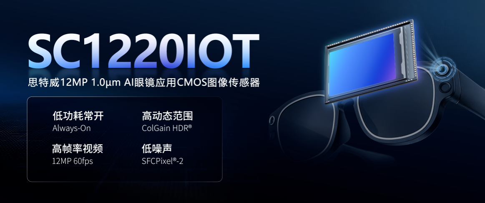
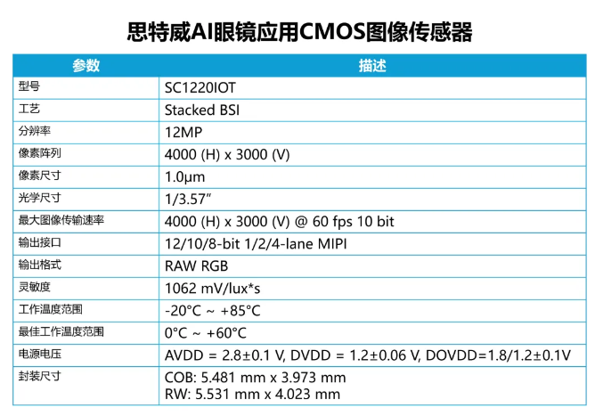
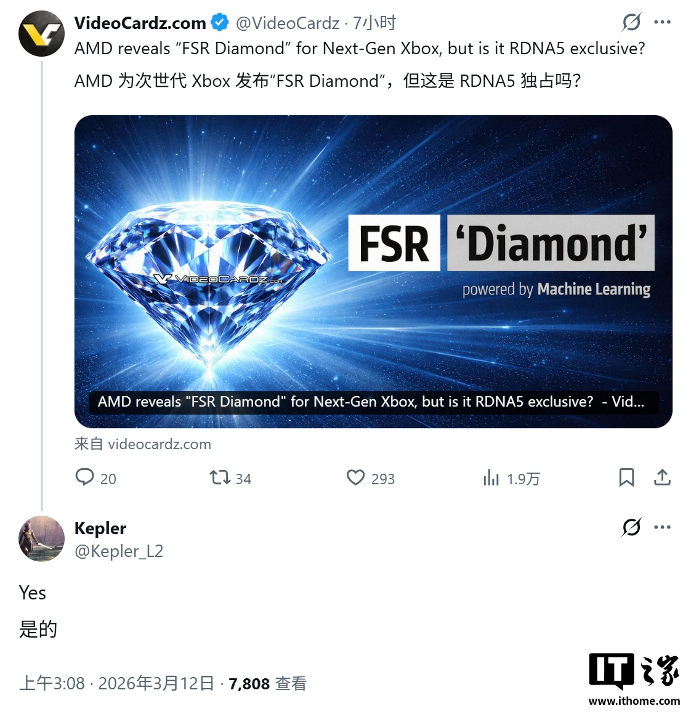
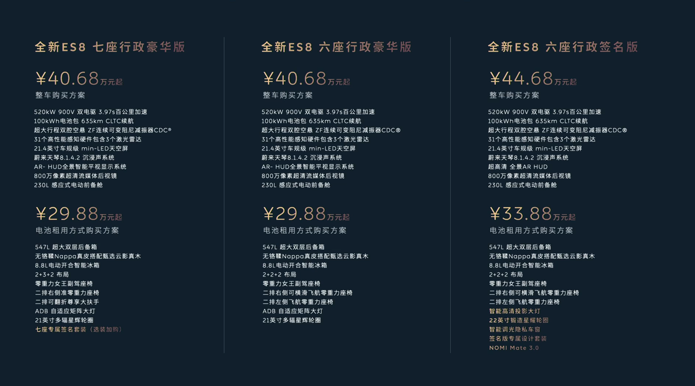
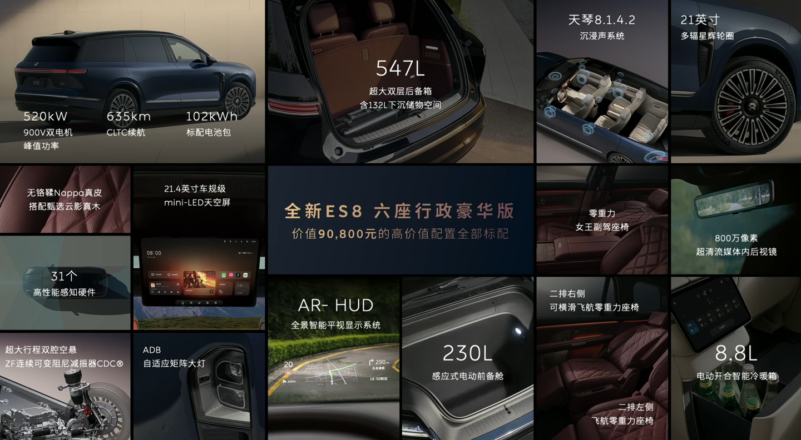

# IT之家每日科技简报 - 2026-03-12

> 聚焦今日科技热点

---

## 今日热门资讯

1. [思特威推出全新 1200 万像素 AI 眼镜应用 CMOS 图像传感器，今年 Q2 量产](https://www.ithome.com/0/928/246.htm)

2. [代号“钻石”：AMD 揭晓 FSR Diamond 超分套件，硬刚英伟达 DLSS](https://www.ithome.com/0/928/246.htm)

3. [蔚来全新 ES8 车型 M42 星云红配色上市，选配价格 10000 元](https://www.ithome.com/0/928/245.htm)

4. [创维集团创始人黄宏生：希望能做汽车行业的传音](https://www.ithome.com/0/928/245.htm)

5. [Tenstorrent 发布业界首款 RISC-V 指令集桌面 AI 工作站 TT-QuietBox 2](https://www.ithome.com/0/884/522.htm)

---

*本文由AI助手从IT之家RSS自动整理*
