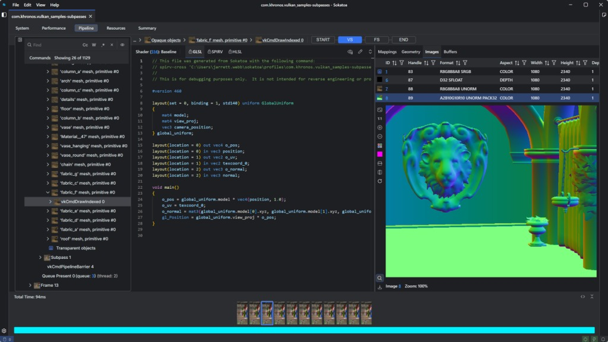
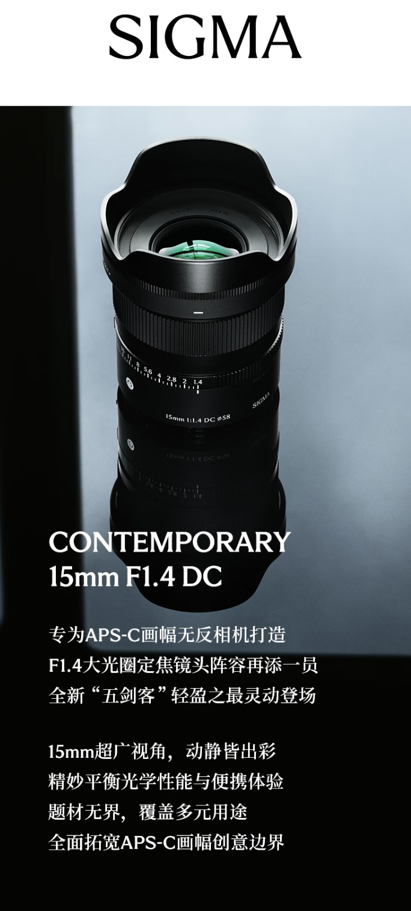
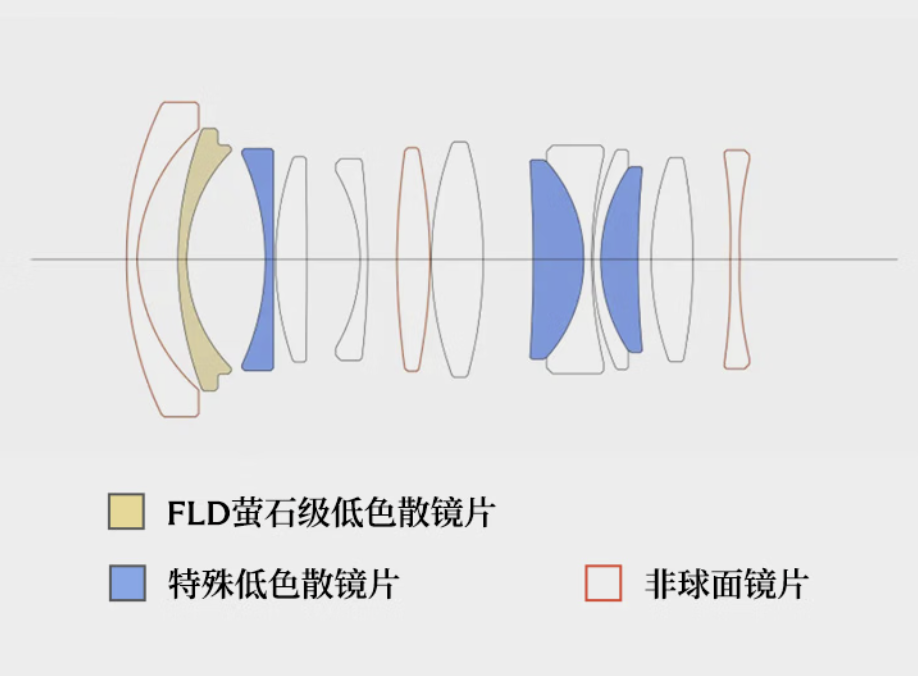

# IT之家每日科技简报 - 2026-03-13

> 聚焦今日科技热点

---

## 今日热门资讯

1. [三星推出 Sokatoa 工具，“显微镜”式揪出安卓手机玩游戏变卡元凶](https://www.ithome.com/0/928/620.htm)

2. [KOORUI 科睿首款电视 Rival 潮玩 S60 亮相：4K 165Hz Mini LED 面板](https://www.ithome.com/0/928/620.htm)

3. [适马推出 15mm F1.4 DC 半画幅相机镜头：提供 X/EF/E 卡口，3099 元](https://www.ithome.com/0/928/619.htm)

4. [高通第五代骁龙 8 至尊版芯片漏洞曝光，可在小米 17 等手机上解锁 Bootloader](https://www.ithome.com/0/928/619.htm)

5. [小鹏 P7 黑武士车色“暗夜黑”3 月 18 日发布，官图先睹为快](https://www.ithome.com/0/928/618.htm)

---

*本文由AI助手从IT之家RSS自动整理*
